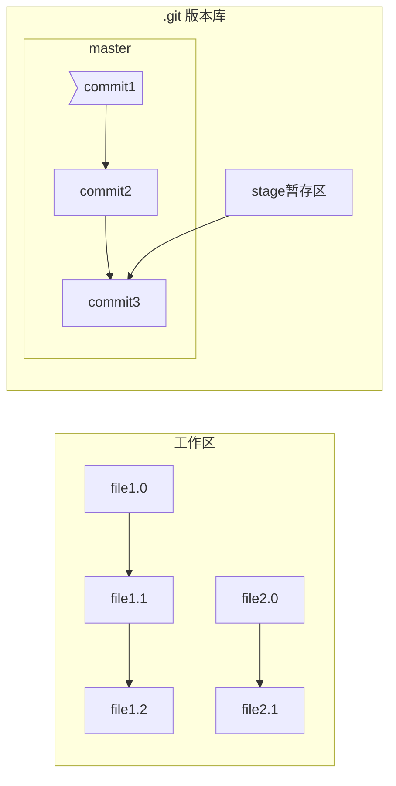
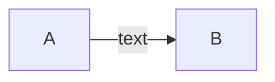
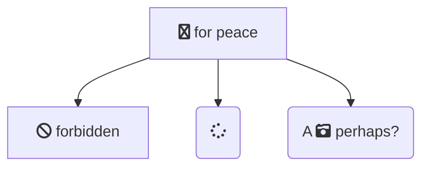

# Git

```mermaid
graph LR
  subgraph 工作区
    file1.0-->file1.1-->file1.2
    file2.0-->file2.1
  end

  subgraph .git 版本库
    subgraph master
      c1>commit1]-->commit2-->commit3
    end
    stage暂存区-->commit3
  end
```

``` mermaid
graph LR
    A-->|text|B
```
或者

``` mermaid
graph LR
    A-- text -->B
```

```mermaid
graph TD
    B["fa:fa-twitter for peace"]
    B-->C[fa:fa-ban forbidden]
    B-->D(fa:fa-spinner);
    B-->E(A fa:fa-camera-retro perhaps?);
```

```mermaid
    graph  LR
        A["A double quote:#quot;"] -->B["A dec #9798; char:#9829;"]
```