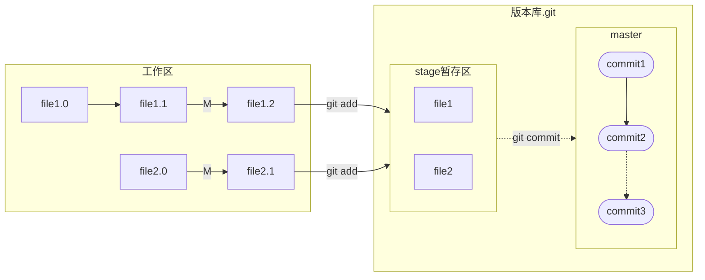
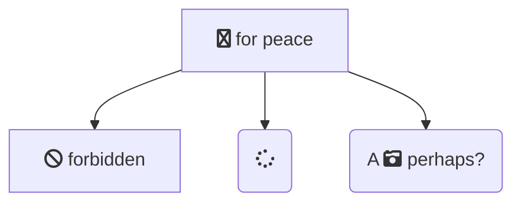

# Git

```mermaid
flowchart LR

  subgraph 工作区
    direction LR
    file1.0-->file1.1--M-->file1.2
    file2.0--M-->file2.1
  end

  subgraph 版本库.git 
    direction LR

    subgraph stage暂存区
      direction LR
      file1
      file2
    end

    subgraph master
      direction TB
      c1([commit1])-->c2([commit2])-.->c3([commit3])
    end
 
  end
  file1.2--git add-->stage暂存区
  file2.1--git add-->stage暂存区
  stage暂存区-.git commit .->master
  
```

```mermaid
graph TD
    B["fa:fa-twitter for peace "]
    B-->C[fa:fa-ban forbidden  ]
    B-->D(fa:fa-spinner);
    B-->E(A fa:fa-camera-retro perhaps?);
```

```mermaid
    graph  LR
        A["A double quote:#quot;"] -->B["A dec #9798; char:#9829;"]
```
:joy:
:dragon:

